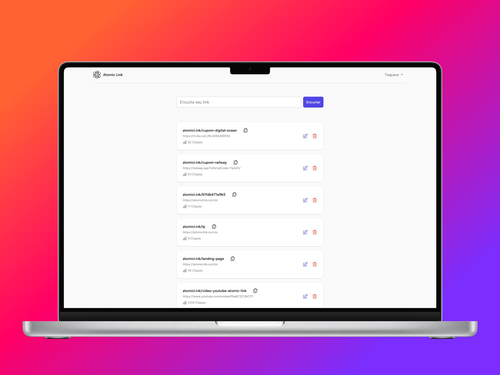

# AtomicLink

**A URL shortener with Meta and Tiktok Pixel support for marketing automation.**

AtomicLink is a URL shortener designed for performance marketing. It allows you to **inject Meta Pixel or TikTok Pixel events** before redirecting users to the final destination — commonly used to **track clicks on WhatsApp links** from ads.

> [Live app (PT-BR)](https://atomiclink.com.br)  
> [Watch Demo Video](https://www.youtube.com/watch?v=XXXXXXXXXXX)

---

## Overview

- Shorten URLs and attach tracking pixels (Meta or TikTok)
- Common use case: **tagging WhatsApp links shared in ads**
- Track click events and redirection analytics
- Used by over **1,000 users** since launch
- Integrated with **Stripe Subscriptions** for monetization

---

## Tech Stack

- **Laravel** – Core backend framework
- **TALL Stack (Tailwind, Alpine, Laravel, Livewire)** – For the frontend
- **FilamentPHP** – Admin panel and user management
- **Redis** – Cache and Queue processing and performance
- **Postgres** – Primary database

---

## Features

- Custom aliases for shortened links
- Pixel injection: Meta Pixel & TikTok Pixel
- Real-time click tracking
- Admin dashboard (Filament)

---

## Repository

This project is **private**, but feel free to [contact me](https://github.com/tiagopaes) if you'd like a **technical walkthrough** or access to a **live demo**.

---
